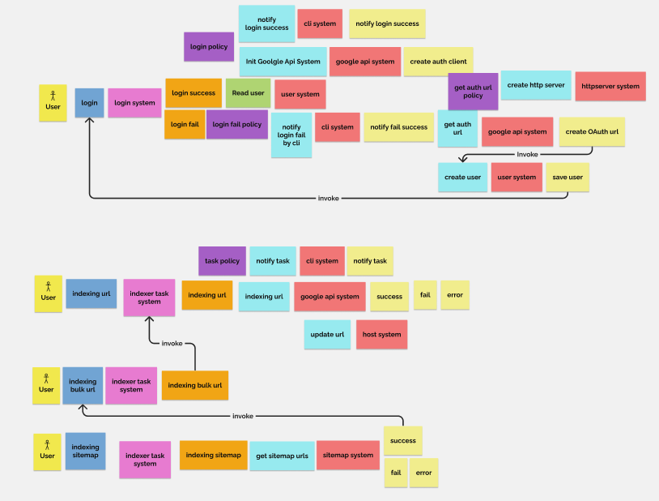
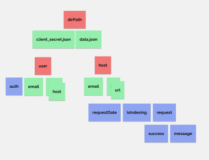

# Google Search Console Indexer

## Event Storming

## Todo
- [X] 00: docs
- [X] 01: login service
  - [X] login
    - [X] service layer
        - [X] http server
    - [X] user repo
    - [X] index api client
      - [X] success
        - [X] getSiteList
        - [X] create auth client
      - [X] fail
        - [X] get auth url
- [X] 02: index service
  - [X] index service layer
  - [X] single url
    - [X] origins repo
    - [X] index api client
      - [X] inspect url
      - [X] indexing url
  - [X] bulk url
  - [X] sitemap url
- [X] 03: controller, input validator
- [X] 04: index module
  - [X] module test
